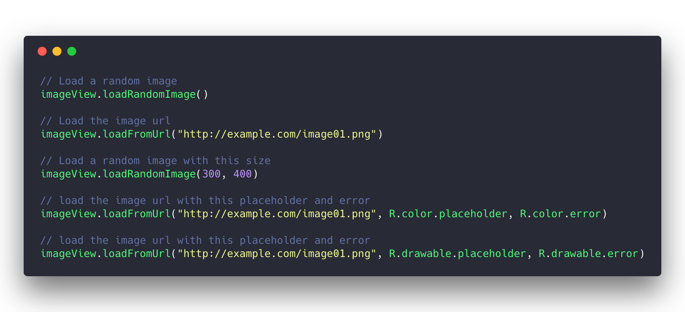

<p align="center"></p>

<h1 align="center">Faker</h1>

<p align="center">A <b>kotlin extension</b> to <b>load images asynchronously</b> on <b>android</b></p>

<p align="center">
	<a href="https://www.android.com"></a>
	<a href="https://android-arsenal.com/api?level=16"></a>
	<a href="https://opensource.org/licenses/MIT"></a>
	<a href="https://jitpack.io/#cesarferreira/faker"></a>
</p>

# Features

- Load random images asynchronously into any `ImageView`
- Load a random image that fits perfectly the size of that `imageView`
- Load any image by passing a simple url into it
- Perfect for image placeholders to jump start a project

# Install
Just add the following dependency in your app's `build.gradle`

```groovy
allprojects { repositories { maven { url 'https://jitpack.io' } }}
```

```groovy
dependencies {
      implementation 'com.github.cesarferreira:faker:1.2.1'
}
```

or use [drone](https://github.com/cesarferreira/drone):

> drone add faker app-module

# Examples
Here are some examples to provide you a head start with using this library.

<div align="center"></div>


<b>`.loadRandomImage()`</b>

```kotlin
imageView.loadRandomImage()
```

<b>`.loadFromUrl(url: String)`</b>

```kotlin
imageView.loadFromUrl("http://sample.com/image.png")
```

<b>`.loadFromUrl(url: String, placeholder: Int, error: Int)`</b>

```kotlin
imageView.loadFromUrl("http://sample.com/image.png", R.color.placeholder, R.color.error)
```

<b>`.loadFromUrl(url: String, placeholder: Drawable, error: Drawable)`</b>

```kotlin
imageView.loadFromUrl("http://sample.com/image.png", R.drawable.placeholder, R.drawable.error)
```

# License
Licensed under `MIT license`. View [license](LICENSE.md).
